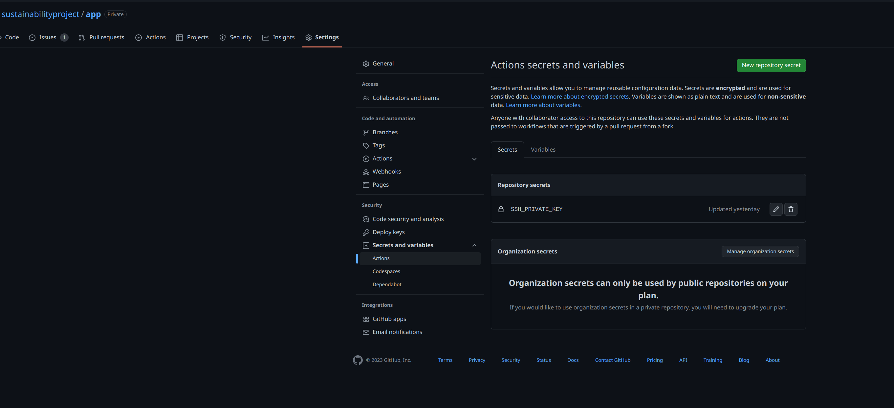

# Automated deploys

By following this guide, you will be able to have automated deploys every time there is a commit to the master branch

## Requirements

- A fresh Ubuntu 20.04LTS+ server with SSH and HTTP available
    - At least 1GB of RAM
- A domain name (e.g. sustainandgain.fun)

## Setup SSH keys

Setup SSH keys to login to the server without a password.

On your local machine, run the following:

```bash
ssh-keygen -t rsa
```
When asked, **DO NOT** set a password.

Copy the new SSH to the server with the following:

```bash
ssh-copy-id root@<YOUR-SERVER-IP>
```

You can test the new keys by running:

```bash
ssh root@<YOUR-SERVER-IP>
```

You should be able to log in with out a password

## Install Dokku

All the heavy lifting for the deploys will done with [Dokku](https://dokku.com). It is self hosted platform similar to [Heroku](https://heroku.com)

You can install it by running:
```bash
wget https://dokku.com/install/v0.30.1/bootstrap.sh
sudo DOKKU_TAG=v0.30.1 bash bootstrap.sh
```

This will install all the dependencies needed and setup Dokku so that it is ready for deployments.

:::note
You may need to manually add your SSH key to Dokku
```bash
cat ~/.ssh/authorized_keys | dokku ssh-keys:add admin
```
:::

Add your IP to the global Dokku domains

```bash
# You can use the IP of your server
dokku domains:set-global <YOUR-SERVER-IP>

# Or you can use sslip.io to get subdomain support
# as you would with a regular domain name
# this would be done by appending `.sslip.io` to your IP address
dokku domains:set-global <YOUR-SERVER-IP>.sslip.io
```

## Create a New App

Create a new app for the game

```bash
dokku apps:create sustainandgain
```

This will create an app ready to be deployed to.

## Create a Postgres Database

While in development, a SQLite database is used but for production we need a more scalable setup. Luckily, Dokku makes it very easy to deploy [PostgreSQL](https://www.postgresql.org/).

First of all, install the Postgres plugin:
```bash
sudo dokku plugin:install https://github.com/dokku/dokku-postgres.git postgres
```

Now you can create a database named `sustainandgaindb`

```bash
dokku postgres:create sustainandgaindb
```

This will do all the setup needed to have a production database.

The app we create earlier needs to communicate with this database, which it is unable to do by default. To enable communication between the two, we can link the database to the app

```bash
dokku postgres:link sustainandgaindb sustainandgain
```

This will allow the app to connect to the database through the `DATABASE_URL` environment variable.

## Initial deployment

We can deploy the app with DEBUG enabled to check that everything works.

Download a copy of the code locally to your machine by running the following:

```bash
git clone https://github.com/sustainabilityproject/app
```

Back on the server, set the following environment variables:

```bash
dokku config:set --no-restart sustainandgain DJANGO_SETTINGS_MODULE=sustainability.settings
dokku config:set --no-restart sustainandgain SECRET_KEY=<random_value> # it is very important that this is random
```

Now we can deploy the first version to check that everything is setup correctly.

On your local machine:
```bash
git remote add dokky dokku@<YOUR-SERVER-IP>:sustainandgain
git push dokku master
```

This will automatically setup the correct [Pipenv](https://pipenv.pypa.io/en/latest/index.html) environment and deploy the app.

After it configures everything, Sustain and Gain should be live at

`http://sustainandgain.<GLOBAL-DOMAIN>`


## Production Mode

Currently, the live version is running in DEBUG mode which is unsafe in a production ennvironment.

At the moment, everytime the app is redeployed, the media files will be deleted. We can fix this by mounting a volume.

On the server:
```bash
mkdir /var/lib/dokku/data/storage/sustainandgain/
chown -R dokku:dokku /var/lib/dokku/data/storage/sustainandgain/
```

And mount:
```bash
dokku storage:mount sustainandgain /var/lib/dokku/data/storage/sustainandgain/staticfiles:/app/staticfiles
dokku storage:mount sustainandgain /var/lib/dokku/data/storage/sustainandgain/mediafiles:/app/media
```

The storage is now persistent. When Django is in production mode, we are in charge of handling serving files. To do this, we will use nginx.

```bash
# Create a new directory
mkdir -p /home/dokku/sustainandgain/nginx.conf.d
# Edit the nginx config file
vi /home/dokku/sustainandgain/nginx.conf.d/static.conf
```

Paste the following:
```nginx
location /static/ {
    alias /var/lib/dokku/data/storage/sustainandgain/staticfiles/;
}

location /media/ {
    alias /var/lib/dokku/data/storage/sustainandgain/mediafiles/;
}
```

Change ownership to the Dokku user:

```
chown -R dokku:dokku /home/dokku/sustainandgain/nginx.conf.d
# Disable DEBUG
dokku config:set sustainandgain DEBUG=0
```

This should restart the app. When you visit the URL, everything should work.

## Create a Gamekeeper account

To manage the game, you will need to create a Gamekeeper account you can do this by running
```bash
dokku run sustainandgain python manage.py createsuperuser
```

Follow all the steps and make sure that the password is secure as this account has full access to the Gamekeeper Area

## Add Domain

Make sure you have an A record on your domain pointing to the server IP.

You can set the domain by typing:
```bash
dokku domains:set sustainandgain sustainandgain.fun
```

This will make the app available at http://sustainandgain.fun.

You will notice that the connection is not secure. We can fix this by setting up Let's Encrypt certificates.

Install Let's Encrypt plugin:
```bash
sudo dokku plugin:install https://github.com/dokku/dokku-letsencrypt.git
```

You will need to add your email for renewal reminders:
```bash
dokku letsencrypt:set sustainandgain email admin@sustainandgain.fun
```

Now you can enable SSL:
```bash
dokku letsencrypt:enable sustainandgain
# Setup cron job to renew certificate
dokku letsencrypt:cron-job --add
# Setup allowed hosts
dokku config:set sustainandgain "ALLOWED_HOSTS=localhost 127.0.0.1 [::1] sustainandgain.fun"
```

You should now be able to visit your domain and SSL should be enabled!

# Automated deploys with GitHub Actions

In your git repository, create a file in `.github/workflows` called `deploy.yml`.

Enter the following:

```yaml
name: Deploy

on:
    push:
    branches: [ "master" ]

jobs:
    deploy:
        runs-on: ubuntu-latest
        steps:
            - name: Cloning repo
            uses: actions/checkout@v3
            with:
                fetch-depth: 0

            - name: Deploy to production
            uses: dokku/github-action@master
            with:
                git_remote_url: 'ssh://dokku@<YOUR-SERVER-IP>:22/sustainandgain'
                ssh_private_key: ${{ secrets.SSH_PRIVATE_KEY }}
```

Now copy the contents of `id_rsa` created earlier into GitHub at `Repository -> Settings -> Secrets -> Actions` and create a new secret called `SSH_PRIVATE_KEY`.



Now everytime there is a commit to master, the code will be deployed to production
