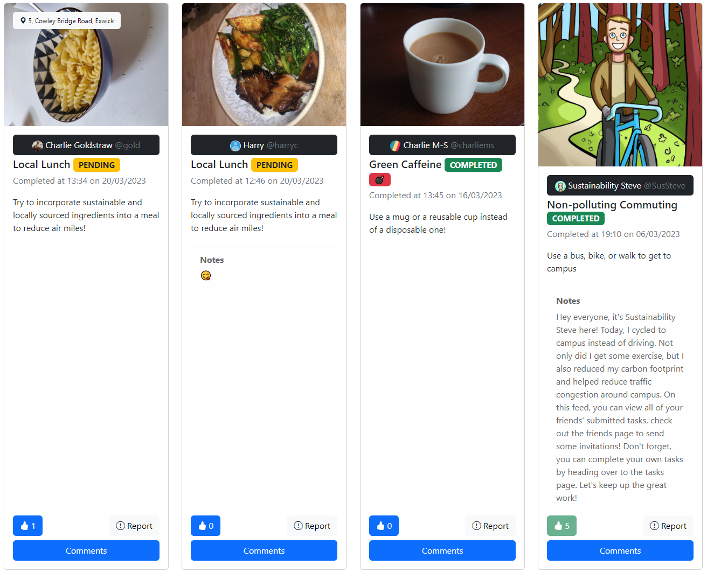
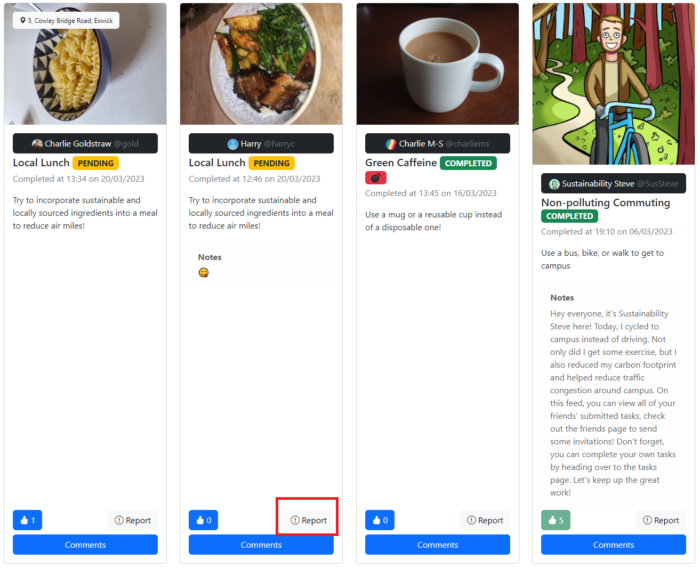
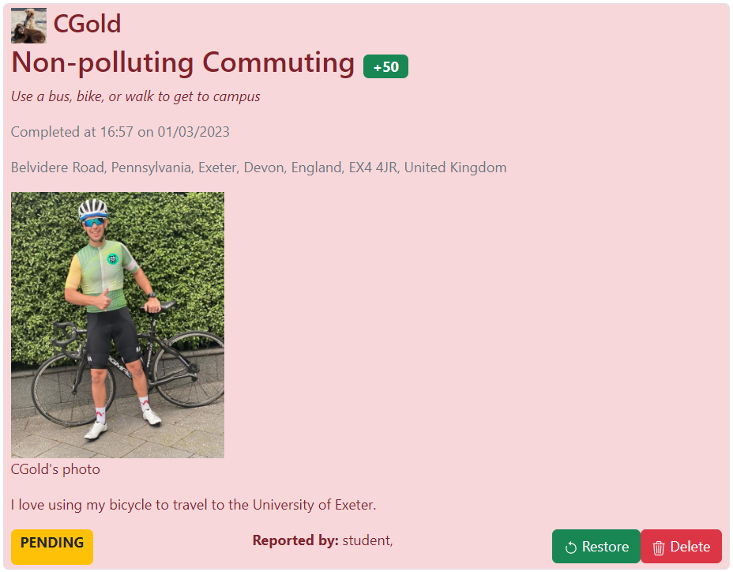

# Feed
Tasks which your friends have completed are listed on the feed, which is the home page of the app.

The newest posts are shown first, and you can like or report posts using the buttons on the task. The report button helps notify staff users of tasks which do not provide sufficient proof of completion, such as omitting location or an irrelevant photo attachment.

## Reported Tasks
Tasks which are reported will be sent to the designated staff members, who can then remove or restore the task from the Reported Tasks page.
