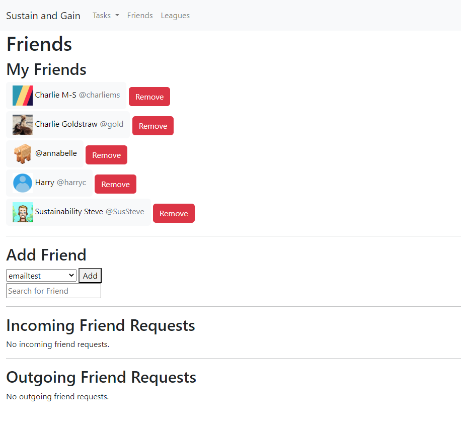
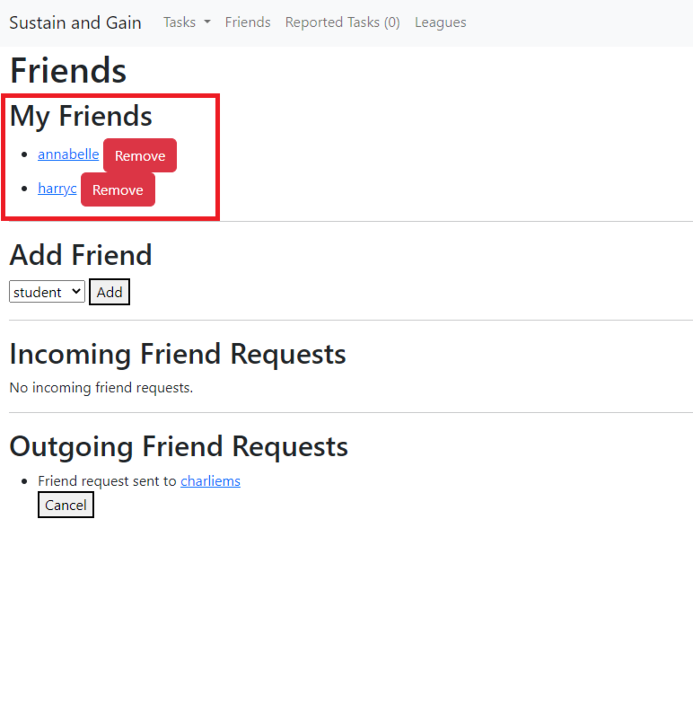
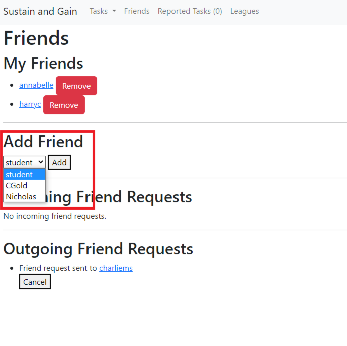
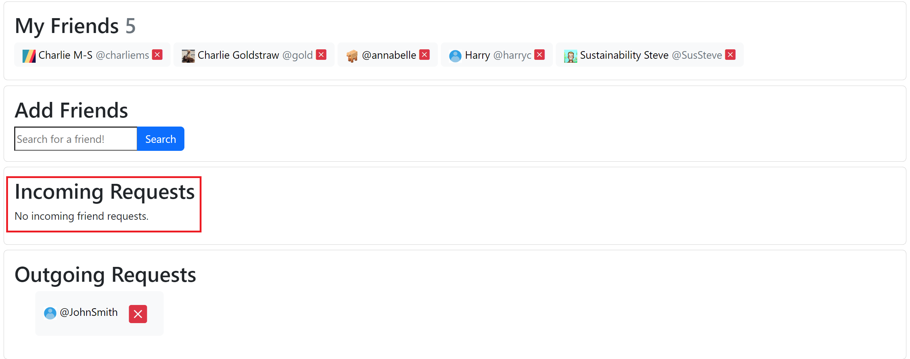
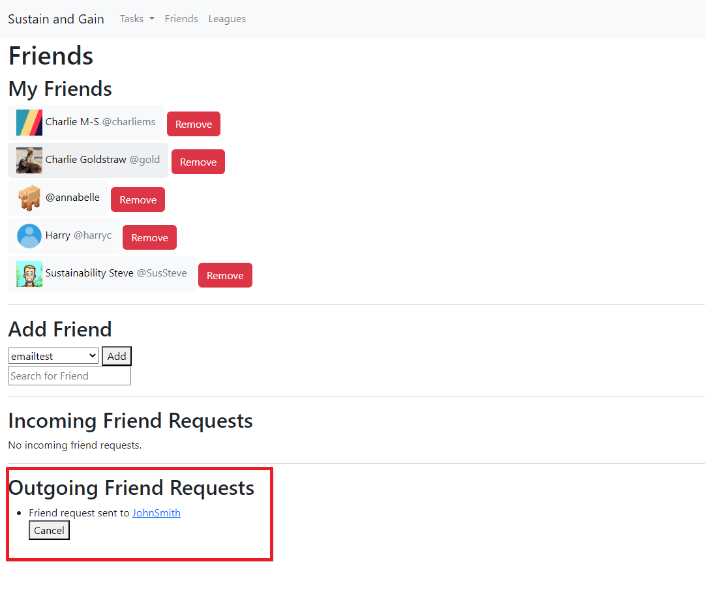

# Friends

From the friends page you are able to do 4 different things:
- View your friends list
- Add other friends from a list of users in a drop-down menu
- See your incoming friend requests
- See your outgoing friend requests

## My Friends
The friends list will display all of the accounts you are currently friends with the ability to click on their name to view their profile.
You Are also able to click on the remove friends button and this will the account from your friends list and your account from theirs.

## Add Friends
In the add friends section you are able to click on the drop-down menu and view accounts that you are not already friends
with. Once you have selected an account you can press the add button which will then send the request.

## Incoming Friend Requests
This section of the friends page is where you can view incoming friend requests and either accept or decline them.

## Outgoing Friend Requests
In this section you will be able to view your outgoing friend requests. There is also a button present that will allow you to
cancel any requests.

