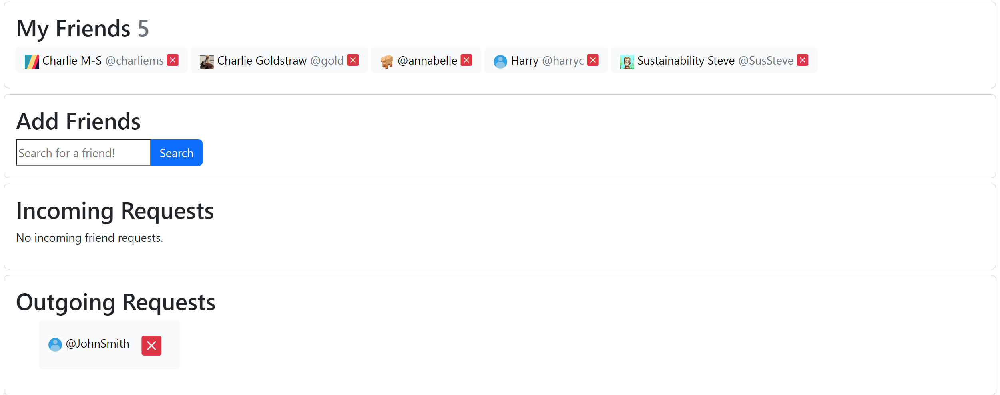
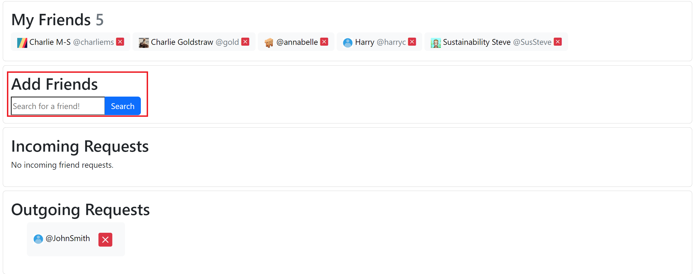

# Your Friends, Your Community
The friends page is where the magic happens! Connect with like-minded individuals, nurture friendships and watch your community grow!

## My Friends - Discover a Community Built on Trust
Our platform believes in fostering authentic connections through our Friends feature. View all of your friends' profiles and easily navigate through their pages to see what they're up to!

## Add Friends - Build Relationships with Ease
Meeting new people can sometimes be challenging, but not anymore! Browse our user-friendly interface and use either the dropdown menu or search bar to find other users you would like to connect with. Building new relationships has never been easier.

 

## Incoming Friend Requests - Gaining New Perspectives 
Expand your network by accepting incoming friend requests from people you may not have met otherwise. You never know, they just might become an integral part of your personal or professional life!

## Outgoing Friend Requests - Exude Confidence and Expand Your Influence 
Grow your network by sending out friend requests confidently! Manage all of your outgoing friend requests easily by viewing them all in one place- cancel any outgoing request at just one click.

We believe that building positive relationships is a key component to leading a happy life both professionally and personally. Join us today and become part of our thriving community!

