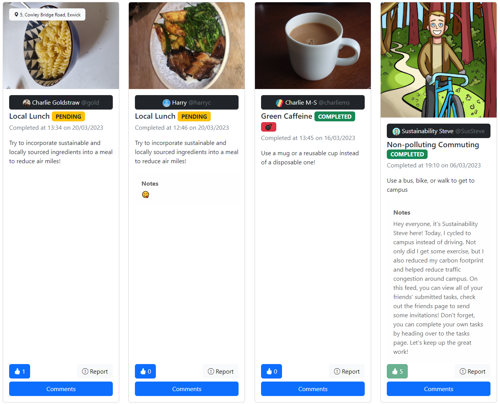
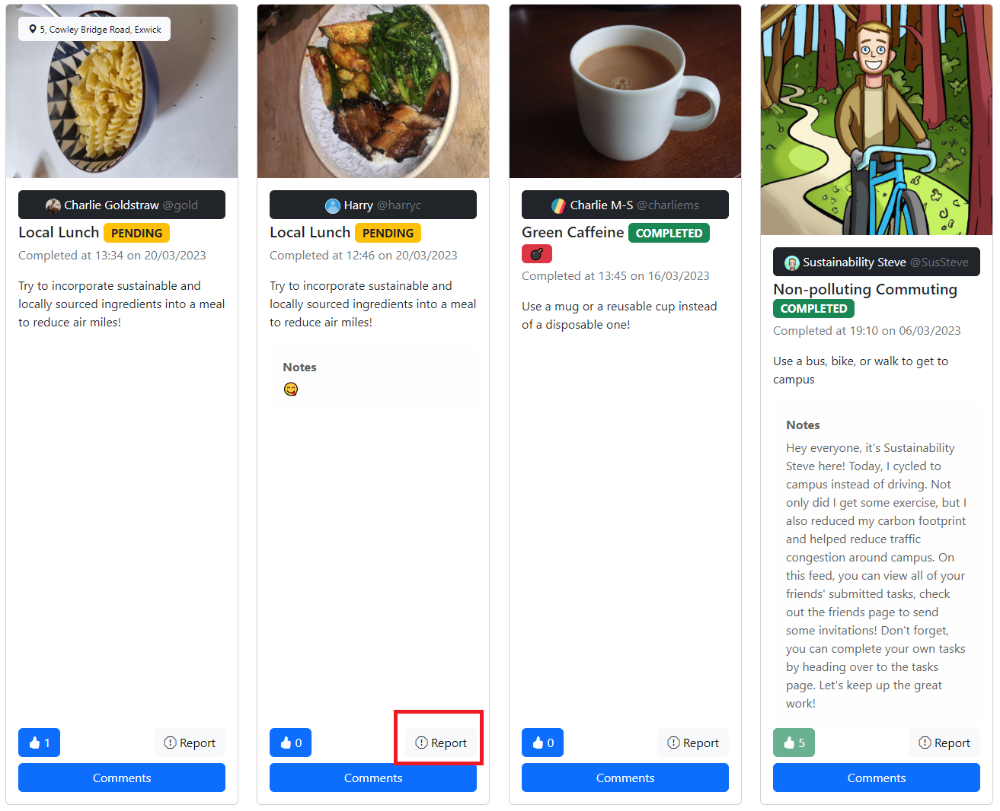

# How to play
## Feed
Tasks which your friends have completed are listed on the feed, which is the home page of the app.

The newest posts are shown first, and you can like or report posts using the buttons on the task. The report button helps notify staff users of tasks which do not provide sufficient proof of completion, such as omitting location or an irrelevant photo attachment.

### Reported Tasks
Tasks which are reported will be sent to the designated staff members, who can then remove or restore the task from the Reported Tasks page.

## Task Validation
Tasks are validated on a decentralised basis. This keeps the workload low for staff members and makes the system scalable to a large cohort of users. A task will be moved from pending to completed upon the following conditions being met:
- The post receives three likes.
- The post has existed on the feed for 1 week.
- The computer vision system determines that the image satisfies the task description.
- A staff member restores the previously reported post.

Points are awarded upon tasks being assigned the completed tag.
