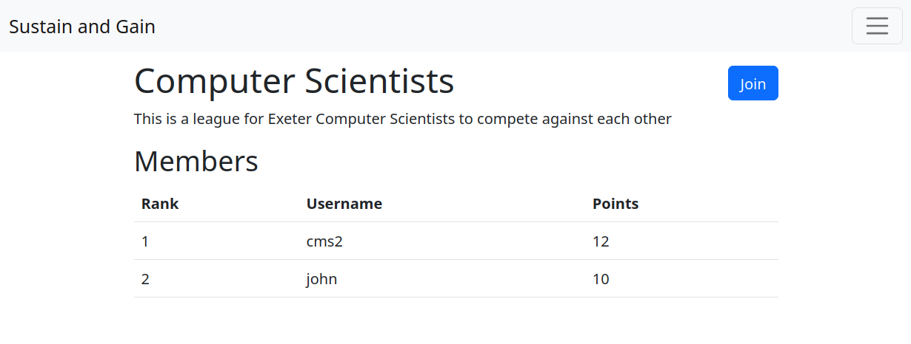
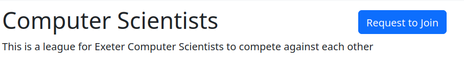
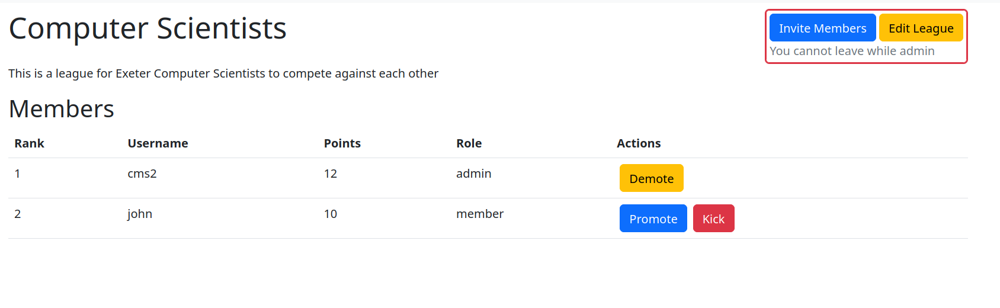
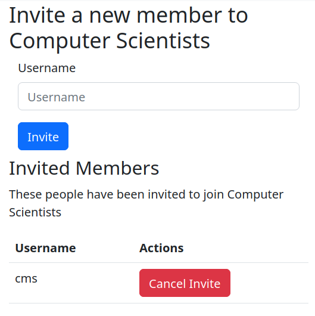
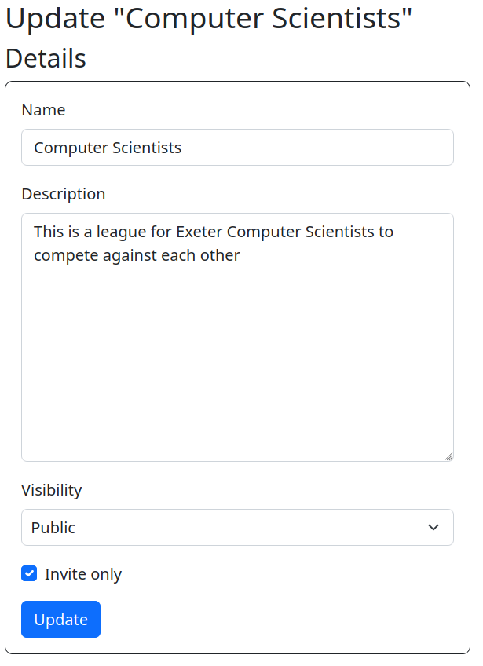

# The Thrill of Competition - Leagues

Join our leagues and experience the thrill of competition, with a chance to showcase your skills while connecting with like-minded individuals!

## An Inclusive Experience for All
Our leaderboard allows you to compete against all users equally, with transparent results! Whether it's public or private, high visibility or low-key private league, we've designed our platform to cater to your individual preferences.

## No Gap Between Accessibility and Competition
Get started by browsing through open leagues that allow anyone in the community to join regardless of level. Seeking more exclusivity? View invite-only leagues where approved members can enter upon request. Creating a league is super easy – click "Create" at /leagues, and become an administrator today!

## A Range of Roles for Your Preferences
Our roles enable you to administer AND participate in equal measure! You can be promoted or demoted on leaderboards according to your position on these league hierarchies. Admins play an integral part in managing all aspects of privacies (visible versus invisible), invitations and overall maintenance- so why not make it YOUR LEAGUE today?

At our heart is an authentic community built on trust- join us today, experience growth while hearing about other's unique stories and share yours too!

## Visibility

A league may either be public or private. If a league is public, it will display to all users (including those not logged in) and all members and points will be public.

If a league is private, it will not show on the public page and members will remain private.

## Joining a league

A league may either be open for anyone to join, or invite-only. If the it is open, a user can click the Join button and they will join immiediately.

If the league is invite-only, a user may request to join or an admin can invite them to join.

### Open League

### Invite-only League

## Roles

Within a league, a user may either be an admin or a member. An admin has the ability to promote, demote, kick and invite members.
Admins can also change the details of the league such as the name and description as well as the visibility and whether the league is invite-only.
Admins may not leave the league to avoid leagues without an owner.

### Admin Overview

### Invite Area

### Edit a League

## Creating a League

Anyone may create by clicking the create button at /leagues. This will assign that user as admin.