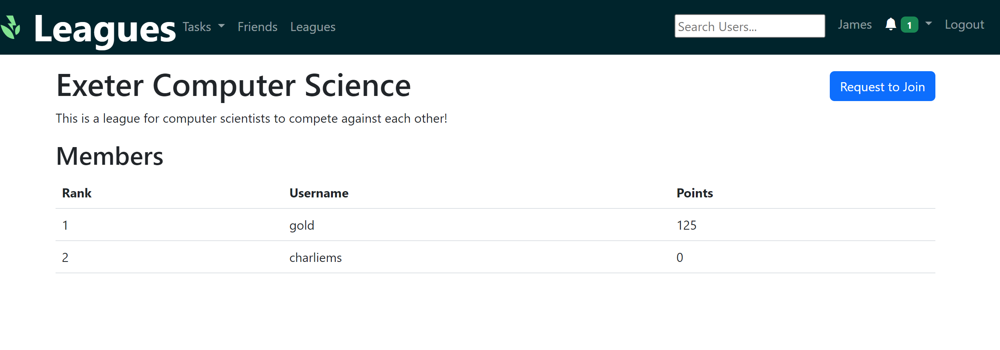
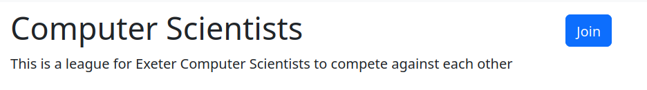

# Leagues

Leagues are a way to compete with all your friends on a leaderboard to see who can get the most points.

## Visibility

A league may either be public or private. If a league is public, it will display to all users (including those not logged in) and all members and points will be public.

If a league is private, it will not show on the public page and members will remain private.

## Joining a league

A league may either be open for anyone to join, or invite-only. If the it is open, a user can click the Join button and they will join immiediately.

If the league is invite-only, a user may request to join or an admin can invite them to join.

### Open League

### Invite-only League

## Roles

Within a league, a user may either be an admin or a member. An admin has the ability to promote, demote, kick and invite members.
Admins can also change the details of the league such as the name and description as well as the visibility and whether the league is invite-only.
Admins may not leave the league to avoid leagues without an owner.

### Admin Overview

### Invite Area

### Edit a League

## Creating a League

Anyone may create by clicking the create button at /leagues. This will assign that user as admin.