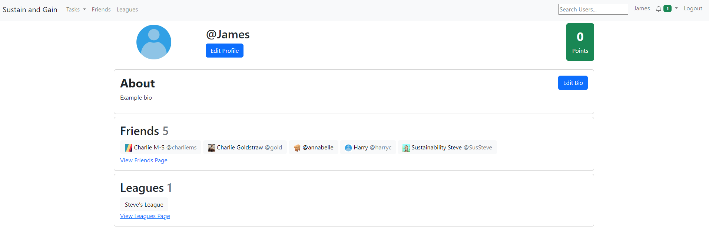

# Profile
The profile page allows you to view your own information. This information includes:
- Profile Picture
- About Section
- Friends
- Points

## Profile Picture
Your profile picture is displayed at the top of the profile page.
## About Section
The about section allows you to add a brief bio or description of yourself.

## Editing Your Profile
By clicking either the change or add link on the profile page you will be able to edit the information on your profile.

Once you have clicked either of these you will be taken to the profile update page.

From this page you are able to add a first and last name, change your profile picture and add a bio
which is displayed on your profile.

## Friends List
From the profile page you are able to see a list of your friends as well as click on their name to view their profile.

## Points
Finally, you are able to view the amount of points that you currently have as well as click the "Get more :)" text which will
take you to the available tasks page

