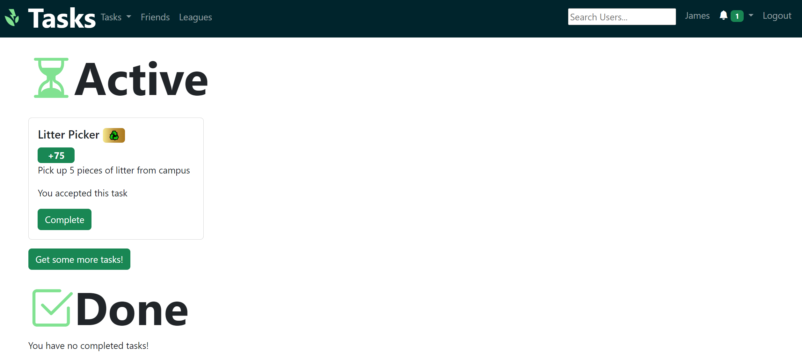
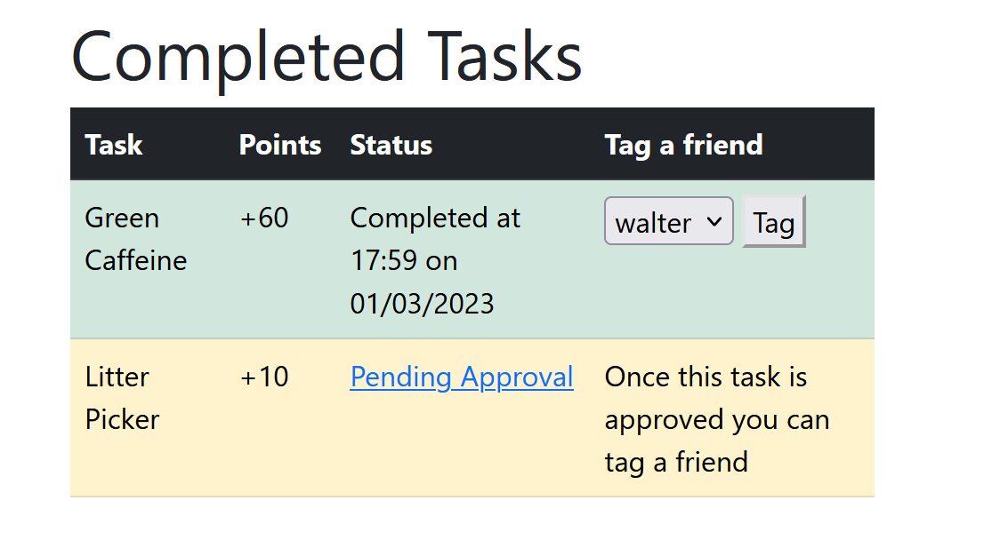

# 🌟 Discover Exciting Tasks 🌟

Embark on a thrilling journey with our Available Tasks! Start by exploring a world of possibilities and challenges that await you.

Simply click the vibrant green button to accept a task, and watch it seamlessly transition to your tasks page. Get ready to earn valuable points, dive into engaging categories, and uncover detailed task descriptions.

## 🏆 My Personalized Task Hub 🏆

Your very own My Tasks page showcases the tasks handpicked by you or those you've received from your friends through tagging. Keep track of your ongoing adventures right here!

## 🎉 Completing Tasks Made Easy 🎉

Finished a task? Celebrate by clicking the green complete button! You'll be prompted to upload a photo of the task and a snapshot of your accomplishment.

Marking a task as completed moves it to the bottom of the 'My Tasks' page, indicating its completion or pending verification status.

Your task may display as pending before it's finalized and you receive the points. To learn more about task validation, click here.

## 🎯 Tag, You're It! 🎯

Share the fun and excitement with your friends by tagging them in tasks you've completed.

Simply browse your completed tasks on the 'My Tasks' page, select your friend from the dropdown menu, and tag away!

## 💣 Bomb Tasks 💣
If you're feeling brave, you can accept a bomb task. You can identify these explosive tasks by the red bomb icon.

Careful though, since once you accept the task it will start ticking down. If you don't complete it in time, you'll lose points instead of gaining them.

