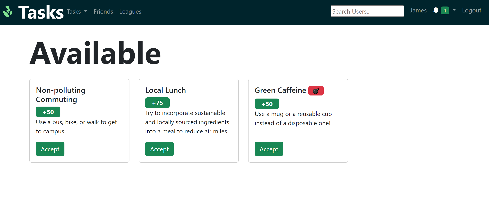

# Available Tasks
At first, you probably won't have any tasks. You can get some by going to the Available Tasks page.

You can accept a task by clicking the green button. Once you've accepted a task, it moves to [your tasks page](#my-tasks).
You can see how many points you'll get once it's completed, which category the task belongs to, and a description of the task.

# My Tasks
Once you've been given a task - either by accepting it from the available tasks page, or from one of your friends [tagging](#tagging) you - it will appear on the 'My Tasks' page.
You can see all the tasks you currently have active here.

# Completing Tasks
Once you've finished a task, simply click the green complete button. You'll be asked to upload a photo of the task, and a photo to show that you completed it.

Some tasks will be instantly verified using our custom AI. Other tasks will become pending, which means they show up in your friends' [feed](./feed.md), where they can report it if you haven't provided sufficient proof of completing the task.

When you mark a task as completed, it will move to the bottom of the 'My Tasks' page, showing whether it is completed or pending verification.

# Tagging
Once you've completed a task, you can tag your friends and give them the same task to do.

All you need to do is look at your previously completed tasks on the 'My Tasks' page, select your friend from the dropdown menu, and tag them.

